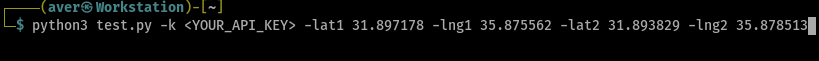

# FAQ:
A script that will pull all google streetview images registered along a path given it's start and end points

# Usage:

Call the script with your GoogleMaps API key and start and end point coordinates

You will then get a folder with all the images along the specified path which you can then use to create a section view, study how the area changed over time and whatever else you can imagine! 